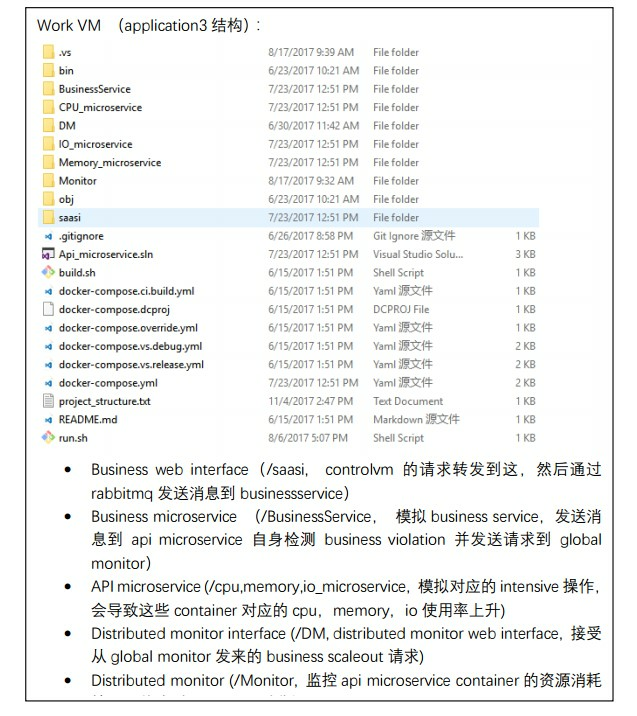

### Deakin vpn： http://software.deakin.edu.au/2017/03/24/pulse-secure-vpn/
### Vm hostname： saasi-vm01.it.deakin.edu.au - saasi-vm24.it.deakin.edu
### Vm01 – vm19 ip： 10.137.0.81 – 10.137.0.99
### Vm20 – vm24 ip： 10.137.0.70 – 10.137.0.74
### 开启vpn后用putty连接vm
 
# <center>Application3实验流程</center> 

> Load generator 模拟发送用户请求到controlvm，通过haproxy负载均衡将请求发送到其他work vm里, workvm的saasi（web interface）接收到请求后，发送消息到business service，business继续将消息分发到对应的api microservice（cpu memory io）处理请求。 Monitor监控 api microservice 的资源消耗并进行scale操作， Business service检测自己是否timeout并将violation信息发送到 controlvm的 globalDM，globalDM将Business service的信息存到数据库中，当达到scale条件时发送请求到DM， DM对business service进行scale。
具体可以看实验论文


## 部署：



### Control vm
1. 将saasi-expriment.sql导入mysql数据库

2. 将 globalMonitor.war 部署到tomcat里（<font color=red>tomcat1 在/usr/local/下，启动和停止文件在tomcat/bin目录下，执行startup.sh的时候,用sudo startup.sh或者sudo sh startup.sh，globalMonitor.war 要放到webapps下</font>）

3. 配置haproxy负载均衡，(<font color=red>要启动:/bin/systemctl start haproxy.service</font>)映射5000端口到其他vm的5001端口（saasi web interface使用）， 当前已部署在vm01上。(这一步，我已经把haproxy.cfg文件的映射ip给改了，放在github上，down下来目录要记得：/etc/haproxy/haproxy.cfg)（广州这台是和上海不同数据中心的，所以只能通过外网和上海的联通，所以haproxy和Program.cs里面都公网ip,这个时间延迟可能会有影响）
    * http://controlvm:5000/haproxy 这个网址能显示各个vm的状态,能打开说明haproxy服务已开启

### Work vm  

1. 安装docker（centos7下命令 yum install docker,然后docker version检查版本号,然后启动service docker start即可）

2. 将Application3 文件夹上传到vm
- 安装.Net Core1.0.4:
https://github.com/dotnet/core/blob/master/release-notes/download-archives/1.0.4-sdk-download.md
```
sudo mkdir -p /opt/dotnet
sudo tar zxf [tar.gz filename] -C /opt/dotnet
sudo ln -s /opt/dotnet/dotnet /usr/local/bin
```
这样的话是全局都是net Core1.0.4

3. (<font color=red>这个脚本单独开一个putty</font>)运行./run.sh 将saasi、business service、api microservice部署到docker container中,（这里特别注意，要先在IO，CPU，Mem下dotnet restore,dotnet build,dotnet publish再去run ）
- 需要安装docker-compose,安装前需要安装python-pip

```
yum install python-pip
pip install --upgrade pip
```

   若提示没有python-pip包:yum -y install epel-release,成功后再次执行 yum install python-pip
    对安装好的pip进行升级 pip install --upgrade pip


- 安装Docker-Compose:
```
pip install docker-compose
pip install --upgrade backports.ssl_match_hostname
docker-compose  --version 
```

4. (<font color=red>新开一个putty</font>)在vm上运行DM(<font color=red>进入到DM/DM文件夹下 再dotnet run，若是报错先运行dotnet restore,再dotnet run</font>)(DM在Application3下面)
5. (<font color=red>开第三个putty</font>)进入Monitor文件夹，运行docker-compose up -d启动cadvisor； 

6. 运行monitor(进入Monitor然后dotnet run) 

7. <font color=red>关闭所有程序时先关掉cadvisor(sudo docker-compose stop) 再关掉其他container(在run.sh脚本的运行框里ctrl c即可关掉其他容器)</font>（DM monitor运行在vm上，其他程序运行在docker container里）(<font color=red>LoadGenerator里面的网址应该 user.Run("http://localhost/saasi/Bussiness:5000")即刚开始发到本机的5000端口,第一次测试可以发到vm3的5001端口上，即绕过loadBalance</font>)
8. <font color=red>在自己电脑或者control vm上，vm1上的代码不对 </font>运行load generator  
           dotnet run <application type>, <user number>, <request time>
例如 dotnet run 3 60 3: 一共60个用户，分成3个批次发送请求(meet error:dotnet restore)
 
Application1 和 2 只有business service，没有 api microservice。
 
## 自动化部署

> 使用ansible，收集数据的路径需要更改，目前存在的问题时从 github pull 项目后， linux 下 dotnet build 输出的目录和 dockfile 输出目录不一致，导致 docker container 无法正 常生成。这个问题解决后可以自动部署和测试整个实验。


## 实验过程
> Load generator 模拟发送用户请求到 controlvm，通过 haproxy 负载均衡将请求 发送到其他 work vm 里, workvm 的 business web interface 接收到请求后，发送消息到 business service，business 继续将消息分发到对应的 api microservice（cpu memory io）处 理请求。 Monitor 监控 api microservice 的资源消耗并进行 scale 操作，将数据存入 txt 文 件。 Business service 检测自己是否 timeout 并将 violation 信息发送到 controlvm 的 globalDM，globalDM 将 Business service 的信息存到数据库中，当达到 scale 条件时发送请 求到 DM， DM 对 business service 进行 scale，将数据存入 txt 文件

## 新增实验内容
- Application3里docker container的配置（cpu、io、memory性能）需要更改，保证application1 和 2里container的配置是application3的三个api container的总和
- 增加net i/o的监控
- 存在的问题：
  - 对io数据的读取不准确，我们监控了block io的读写速率作为scale的标准，是通过对cadvisor的数据计算得出，但只在io microservice container运行的初期比较准确（和 docker stats命令里的数据相比）
  - Container之间通过rabbitmq传递消息和分配请求，考虑改成REST请求并进行loadbalance （可以将整个vm cluster部署为docker swarm来实现）

## 新增实验内容（2017/11/20）
>    我们可以做个RESOURCE container的SCALE in。 现在是超过一个百分比 （可以说是SCALE OUT THRESHOLD）,当前系统就会SCALE OUT (我们没有SCALE UP)。  我们可以设另外一个百分比 （可以说是SCALE IN THRESHOLD)。 比如说， 如果GLOBAL MONITOR 发现所有的CPU CONTAINER都低于这个百分比， 就可以发出指令关闭一个。 每隔1分钟，检查一次（实际上是DEPENDENT ON 实验的长短，可以去 1/5的实验时间）。被关闭的CONTAINER再完成所有任务后，就自我退出，同时没有新任务会发给。

>   对了之前实验（也就是saasi-experiment）这个代码的自动化其实很粗糙。有很多地方可以改进。比如  每次测试的时候，是把 microservice 的源代码pull到每台机器上，然后在每台机器上现场build。这个其实会影响效率。应该要build好之后推到docker registry，然后每台机上直接pull这个docker image。https://github.com/dotnet-architecture/eShopOnContainers 可以参考这个.NET Microservices的样例程序
> 主要是要增加Application1和Application2的实验对比，然后scale down的部分用工业界成熟的方案

### 安装 Ansible (版本2.4.1)
- centos用户用命令

```
yum install epel-release
sudo yum install ansible
```


 
